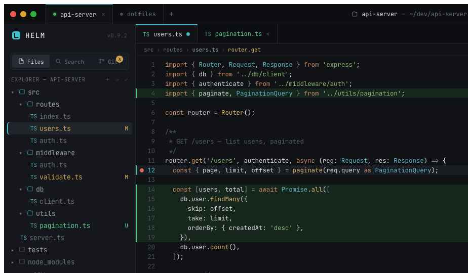

# Shorikai — AI Agent Cockpit

> Terminal, editor, and multi-project agent crew in one window.



Shorikai is a desktop IDE built for human-AI pair programming. It combines a full terminal emulator, a Monaco code editor with LSP support, and an AI agent communication layer into a single unified cockpit — giving you complete visibility into what your agents are doing across multiple projects.

Built with **Tauri 2 + Rust + React**.

## Features

- **Integrated Terminal** — Full PTY-backed terminal emulator (xterm.js + WebGL)
- **Code Editor** — Monaco editor with Language Server Protocol support (TypeScript, Go, Angular, and more)
- **AI Agent Chat** — Stream conversations with coding agents via the Agent Communication Protocol (ACP)
- **Multi-Agent Crew** — Run and monitor multiple sub-agents with live status tracking
- **Multi-Project Workspaces** — Tab-based project switching with session persistence
- **Git Integration** — Stage, unstage, commit, and view diffs without leaving the cockpit
- **Debugging** — Full DAP support with breakpoints, step controls, call stack, variables, and console (Go via Delve, JavaScript via js-debug)
- **File Search** — Fuzzy file finder and ripgrep-powered content search
- **Previews** — Render Markdown, HTML, and images as ordinary panes
- **Status Bar** — Live cockpit vitals showing project and agent state

## Prerequisites

- [Node.js](https://nodejs.org/) (LTS recommended)
- [Rust](https://www.rust-lang.org/tools/install) toolchain
- [Tauri CLI](https://v2.tauri.app/start/prerequisites/)

## Getting Started

```bash
# Install frontend dependencies
npm install

# Run in development mode (Vite + Tauri)
npm run dev
```

## Building

```bash
# Build the desktop application
npm run tauri build
```

The compiled binary will be available in `src-tauri/target/release/`.

## Project Structure

```
shorikai/
├── src/                   # React/TypeScript frontend
│   ├── chrome/            # Shell UI (titlebar, sidebar, status bar, panels)
│   ├── panes/             # Content panes (terminal, chat, editor, debug, preview)
│   ├── bus.ts             # Cross-pane event bus
│   ├── debug.ts           # DAP client
│   ├── lsp.ts             # LSP client
│   ├── gitStore.ts        # Git integration
│   └── projects.ts        # Workspace state management
├── src-tauri/             # Rust backend
│   └── src/
│       ├── pty_host.rs    # PTY session manager
│       ├── acp_bridge.rs  # Agent Communication Protocol bridge (JSON-RPC)
│       ├── lsp_host.rs    # LSP server process manager
│       ├── dap_core.rs    # Debug Adapter Protocol client
│       ├── git_status.rs  # Git operations
│       └── workspace_index.rs  # File indexing & search
└── design/                # Design assets and screenshots
```

## Configuration

| File | Purpose |
|------|---------|
| `~/.config/shorikai/lsp.json` | Language server configuration (auto-created with defaults) |
| `.shorikai/debug.json` | Per-project debug adapter configuration |

## Tech Stack

| Layer | Technology |
|-------|-----------|
| Desktop framework | Tauri 2 (Rust) |
| Frontend | React 19, TypeScript 5.8, Vite 7 |
| Editor | Monaco Editor |
| Terminal | xterm.js 6 with WebGL rendering |
| Layout | dockview-react |
| Font | JetBrains Mono |

---

### Why "Shorikai"?

The name comes from [**Shorikai, Genesis Engine**](https://scryfall.com/card/neo/44/shorikai-genesis-engine) — a legendary Vehicle artifact from *Magic: The Gathering* (Kamigawa: Neon Dynasty). Shorikai is a giant mech that draws cards and creates Pilot tokens to crew itself. It felt like the perfect metaphor: an AI-powered cockpit that bootstraps its own crew of agents to get the job done. Plus, it's a mech. Who doesn't want to work inside a mech?
