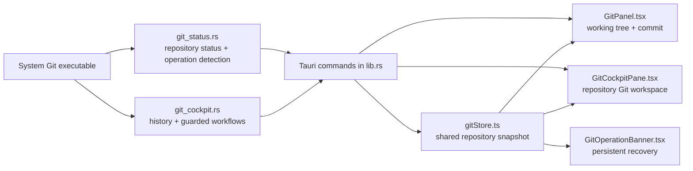

# Shorikai Git Functionality

This document explains Shorikai's Git functionality as implemented in the
desktop application. It covers the user-facing workflows, the Git commands and
repository metadata behind them, safety rules, restart recovery, configuration,
and known scope boundaries.

## Contents

1. [Design principles](#design-principles)
2. [Architecture and state flow](#architecture-and-state-flow)
3. [Repository state and refresh](#repository-state-and-refresh)
4. [Source Control sidebar](#source-control-sidebar)
5. [Branch browser and Fetch](#branch-browser-and-fetch)
6. [Commit history and filtering](#commit-history-and-filtering)
7. [Commit inspection and diffs](#commit-inspection-and-diffs)
8. [File history and blame](#file-history-and-blame)
9. [Branch comparison](#branch-comparison)
10. [Stashes](#stashes)
11. [Conflict resolution](#conflict-resolution)
12. [Persistent operation recovery](#persistent-operation-recovery)
13. [Merge](#merge)
14. [Cherry-pick](#cherry-pick)
15. [Revert](#revert)
16. [Linear rebase](#linear-rebase)
17. [Interactive rebase](#interactive-rebase)
18. [Push and first publication](#push-and-first-publication)
19. [Force-with-lease after rewrites](#force-with-lease-after-rewrites)
20. [Safe branch deletion and Undo](#safe-branch-deletion-and-undo)
21. [Configuration](#configuration)
22. [Tauri command surface](#tauri-command-surface)
23. [Intentional limitations](#intentional-limitations)
24. [Verification coverage](#verification-coverage)

## Design principles

Shorikai exposes Git semantics instead of inventing a second version-control
model. The application follows these rules:

- The installed system `git` executable is the source of truth.
- Repository-wide investigation and operations live in a docked **Git** tab.
- The compact **Source Control** sidebar remains focused on working-tree changes,
  staging, and committing.
- Opening an investigation surface does not perform a network request.
- Destructive operations show their exact target and impact before execution.
- Recovery comes from native Git metadata, so an operation survives application
  restart.
- Unsupported or deliberately excluded workflows keep Terminal as an escape
  hatch.
- Shorikai never exposes unconditional force push or automatic force checkout.

The approved interaction and destructive-language review is recorded in
[`design/git-cockpit-safety-review.md`](../design/git-cockpit-safety-review.md).

## Architecture and state flow

The Git feature is divided into a small status adapter, a higher-level workflow
adapter, a shared frontend store, and two UI locations.



Key source files:

| Responsibility | Source |
| --- | --- |
| Porcelain status, exact working-tree diffs, operation detection | [`src-tauri/src/git_status.rs`](../src-tauri/src/git_status.rs) |
| Branches, history, stashes, comparisons, conflicts, and guarded operations | [`src-tauri/src/git_cockpit.rs`](../src-tauri/src/git_cockpit.rs) |
| Tauri command registration | [`src-tauri/src/lib.rs`](../src-tauri/src/lib.rs) |
| Shared repository snapshots | [`src/gitStore.ts`](../src/gitStore.ts) |
| Compact Source Control UI | [`src/chrome/GitPanel.tsx`](../src/chrome/GitPanel.tsx) |
| Docked Git workspace | [`src/panes/GitCockpitPane.tsx`](../src/panes/GitCockpitPane.tsx) |
| Restart-recoverable operation banner | [`src/chrome/GitOperationBanner.tsx`](../src/chrome/GitOperationBanner.tsx) |

The frontend does not execute arbitrary Git strings. It invokes named Tauri
commands whose Rust implementations validate refs, paths, actions, and safety
preconditions before calling Git.

## Repository state and refresh

Each open project has a shared `GitStatus` snapshot containing:

- current branch name;
- full `HEAD` revision;
- detached-HEAD state;
- upstream ref;
- ahead and behind counts;
- conflict count;
- configured remote names;
- the remote-declared default branch;
- linked worktrees and the branches they occupy;
- the current Git operation, if one exists;
- staged and unstaged file states, including original rename/copy paths.

Status collection combines stable Git plumbing with NUL-delimited porcelain:

```text
git status --porcelain -z --branch
git rev-parse --verify HEAD
git symbolic-ref --quiet --short HEAD
git rev-parse --abbrev-ref --symbolic-full-name @{upstream}
git diff --name-only --diff-filter=U -z
git remote
git worktree list --porcelain
git rev-parse --absolute-git-dir
```

The shared frontend store refreshes:

- when a project begins Git tracking;
- after a Shorikai Git mutation;
- when the workspace watcher emits `ws:changed`;
- every five seconds as a safety net for changes made in Terminal or another
  application.

If status collection fails, the project is treated as not being a usable Git
repository. Git failures do not replace a valid ref with invented state.

## Source Control sidebar

The Source Control sidebar is the working-tree surface. It separates files into
**Staged** and **Changes** using the index and worktree columns from porcelain
status.

### Stage and unstage

- Per-file stage: `git add -- <path>`
- Stage all: `git add -A`
- Per-file unstage: `git restore --staged -- <path>`

The `--` separator prevents a path beginning with `-` from being interpreted as
an option.

### Correct diff boundaries

The row selected by the user determines the diff boundary:

| Row | Original side | Modified side |
| --- | --- | --- |
| Staged | `HEAD:<original-or-current-path>` | `:<current-path>` from the index |
| Unstaged | `:<original-or-current-path>` from the index | working-tree file |

This distinction matters when a file contains both staged content and later
unstaged edits. The staged row never includes the later worktree edits, and the
unstaged row begins at the index rather than `HEAD`.

New or untracked files use an empty original side. Deleted files use an empty
modified side. Renames and copies retain both current and original paths. Text
diff extraction refuses binary files and files larger than 10 MiB.

### Commit

The Commit button runs:

```text
git commit -m <message>
```

It is disabled when nothing is staged or the message is blank. `Cmd+Enter` is
the keyboard equivalent. Repository hooks run normally because Shorikai calls
the standard Git command.

### Quick stash and Push entry

The compact **stash** action performs `git stash push -u`. Full stash management
is available in the Git workspace.

When the current branch is ahead, **Push** opens the push preview instead of
executing `git push` immediately.

## Branch browser and Fetch

The current branch badge in the project title bar opens the **Branches** section
of the docked Git workspace.

### Branch data

Branches are read with `git for-each-ref` over `refs/heads` and `refs/remotes`.
Each item contains:

- short name and full revision;
- local or remote classification;
- upstream;
- current-branch marker;
- remote-default marker;
- protected state;
- linked-worktree path, if occupied.

Remote symbolic `*/HEAD` rows are excluded from the selectable list. The remote
default is resolved from symbolic refs under `refs/remotes/*/HEAD`. A local
branch corresponding to that remote default is also considered default and
protected.

Opening the browser performs no fetch. Search filters the already loaded local
ref data.

### Explicit Fetch

Fetch runs only when the user presses **Fetch**:

```text
git fetch --prune [remote]
```

The UI shows running state and the last successful fetch time. Git inherits the
process environment, so standard credential helpers and SSH agents remain in
use. A recoverable failure offers **Open Terminal** and **Retry**.

### Creating branches

Shorikai can create a branch from:

- the current `HEAD`;
- another local or remote ref;
- a selected historical commit.

The branch name is validated by `git check-ref-format --branch`. Depending on
the chosen action, Shorikai uses either:

```text
git branch <name> [start]
git switch -c <name> [start]
```

Creating a branch never resets an existing same-named branch.

### Checkout and remote tracking

A normal local checkout uses `git switch <target>`. Git decides whether the
dirty tree can move safely; a clean or non-overlapping checkout completes
without an extra modal.

Selecting a remote-only branch:

1. derives the same local name by removing the remote prefix;
2. refuses to proceed if that local name already exists;
3. directs the user to branch comparison on collision;
4. otherwise runs `git switch --track -c <local> <remote/ref>`.

The new local branch is therefore switched to and configured with the selected
remote branch as upstream.

Branches checked out by linked worktrees remain protected by Git's own switch
rules and are identified in the browser before action.

### Smart Checkout

When ordinary checkout would overwrite local work, the user may explicitly
choose **Smart Checkout**. It performs:

1. `git stash push -u -m "Shorikai smart checkout <process-id>"`;
2. `git switch <target>`;
3. `git stash pop`.

Tracked and untracked files are included. If switching fails, Shorikai attempts
to restore the stash immediately. If restoration conflicts, checkout remains
complete and the clearly labelled stash remains discoverable for recovery.
Shorikai never uses force checkout.

## Commit history and filtering

History opens or focuses a docked **Git** tab. It is not squeezed into the
Source Control sidebar.

The desktop layout contains:

- a ref and filter rail;
- a commit graph/list;
- a commit inspector with changed files and inline diff preview.

Below 900 px, the inspector moves below the graph. The first page requests 200
commits; older history loads in 200-commit increments without a persistent
index.

### Commit data

History uses `git log` with record and field separators that do not depend on
human-formatted columns. Each parsed commit contains:

- full hash;
- every parent hash;
- subject;
- author name and email;
- commit timestamp;
- decorations for `HEAD`, local branches, remote branches, and tags.

Multiple parents are retained for merge topology. If any parent is outside the
current page or filtered result, the row is marked with a continuation indicator
instead of connecting it to an unrelated visible commit.

### Repository-wide filters

Filters are passed to Git, not applied to the currently loaded React rows:

| Filter | Git behavior |
| --- | --- |
| Ref | one or more validated revisions; comma-separated refs are ORed |
| Exact hash | 4–40 hexadecimal characters resolve directly to one commit |
| Message | `--grep` with extended regular expressions |
| Author | `--author`, preserving name/email matching |
| After | `--after`; labelled as commit date |
| Before | `--before`; labelled as commit date |
| Path | literal repository path after `--` |

Categories combine with AND because they are supplied together to one `git log`
query. OR behavior inside message or author filters is available through an
extended regular-expression alternation such as `Alice|Bob`. Multiple refs are
provided as separate revision arguments.

Active filters appear as individually removable controls and can also be cleared
together. General path filtering remains literal; only the dedicated File
History workflow claims rename following.

## Commit inspection and diffs

Selecting a commit loads its changed paths with:

```text
git diff-tree --root --no-commit-id -r -M -C --name-status <commit>
```

The inspector shows metadata, rename/copy origins, and operation actions.
Selecting a changed file loads an inline parent-to-commit preview. Double-click
opens the existing full Monaco Diff pane.

For a normal commit, the original side is `<commit>^:<old-or-current-path>` and
the modified side is `<commit>:<current-path>`. A root commit uses an empty
original side. Binary content is rejected from the text preview.

One or more commits can be marked for whole-commit cherry-pick or sequential
revert review.

## File history and blame

### File History

File History opens from an editor or a changed-file row. It runs:

```text
git log --all --follow --name-status -- <path>
```

The view displays the commit sequence and extracts previous paths from Git rename
records, allowing a rename chain to be followed backward. Clicking a commit uses
the shared history inspector.

### Blame

Blame is off by default. When enabled, Shorikai parses:

```text
git blame --line-porcelain [--ignore-whitespace] -- <path>
```

Each line carries author name, email, timestamp, full hash, and source text. The
editor displays abbreviated hashes and author annotations. Hover shows exact
identity, timestamp, and revision. Selecting a blame glyph opens the responsible
commit in repository history.

Annotations reload after a saved file change or repository revision change.
Whitespace-insensitive blame is supported by the backend through `-w`.

## Branch comparison

Comparison is the common review surface for checkout collisions, merges,
deletion, rejected pushes, and rebase preflight. Opening it does not fetch.

Given the current and selected branches, Shorikai calculates:

```text
git merge-base <current> <selected>
git log <selected>..<current>
git log <current>..<selected>
git diff --name-status <current> <selected>
```

The result uses real branch names and classifies topology as:

| Topology | Meaning |
| --- | --- |
| Identical | Neither side has unique commits |
| Fast-forward | Current has no unique commits; selected is ahead |
| Already contained | Selected has no unique commits; current already contains it |
| Divergent | Both sides have unique commits |

The view shows merge base, ahead/behind counts, commits unique to each side, net
changed files, explicit outcome language, and relevant actions. It also exposes
the repository's explicit `merge.ff` value when configured.

## Stashes

The **Stashes** section provides named creation, inspection, restoration, and
deletion.

### Create

```text
git stash push [-u] [-m <message>]
```

Including untracked files is an explicit choice in the full manager.

### List and inspect

`git stash list` supplies the stash ref, revision, message, timestamp, and source
branch. `git stash show --name-status` supplies changed paths. Selecting a file
uses the stash commit's parent-to-stash content for inline or Monaco diff.

Smart Checkout recovery entries retain their `Shorikai smart checkout` label.

### Apply, Pop, and Drop

- **Apply** runs `git stash apply <ref>` and preserves the stash.
- **Pop** runs `git stash pop <ref>` and removes it only after successful
  restoration. Git preserves it when restoration conflicts.
- **Drop** runs `git stash drop <ref>` only after confirmation.

Only refs beginning with `stash@{` are accepted by the action command.

## Conflict resolution

Conflict state is reconstructed from Git's unmerged index; Shorikai does not
maintain a parallel conflict database.

For every path from `git diff --name-only --diff-filter=U`, Shorikai reads:

- stage 1 (`:1:<path>`) as the base;
- stage 2 (`:2:<path>`) as current;
- stage 3 (`:3:<path>`) as incoming;
- the working-tree file as Git's combined result with conflict markers and
  non-conflicting edits.

### Text conflicts

The resolver presents:

- read-only current content;
- editable result content;
- read-only incoming content;
- base content on demand.

The user can restore Git's non-conflicting working result, accept current,
accept incoming, accept both, or edit manually. **Save & Mark Resolved** writes
the result and runs `git add -A -- <path>`.

### Delete/modify and missing stages

An absent index stage is represented by empty content. Choosing a missing side
removes the working-tree file before staging the path.

### Binary conflicts

Any NUL byte in base, current, incoming, or working content marks a binary
conflict. Text editing is disabled; the user chooses the whole current or
incoming indexed side.

Resolving the last path reduces the repository conflict count to zero and
enables the parent operation's Continue action. Abort remains available until
Git reports that the operation has ended.

## Persistent operation recovery

The operation banner sits above the dock and is derived from files and
directories inside the actual Git directory:

| Marker | Shorikai state |
| --- | --- |
| `MERGE_HEAD` | Merge in progress |
| `rebase-merge/` or `rebase-apply/` | Rebase in progress |
| `CHERRY_PICK_HEAD` | Cherry-pick in progress |
| `REVERT_HEAD` | Revert in progress |
| `BISECT_START` | External bisect detected |
| symbolic `HEAD` unavailable with a valid revision | Detached HEAD |

Merge, cherry-pick, revert, and rebase expose native Continue/Abort actions as
appropriate. Rebase also exposes Skip. Continue remains disabled while unmerged
paths exist. Resolve opens the in-app conflict workspace.

For rebase, Shorikai reads `msgnum`/`next`, `end`/`last`, and
`stopped-sha`/`original-commit` to display progress and current commit. Native
autostash marker files keep restoration state visible.

Bisect remains Terminal-managed. Detached HEAD offers explicit branch creation
instead of silently allowing commits to become difficult to find.

Commands that might invoke an editor set `GIT_EDITOR=true`, preventing an
external editor from blocking the GUI while retaining normal Git sequencing and
hooks.

## Merge

Merge always begins from branch comparison.

### Preflight and `merge.ff`

The comparison identifies identical, contained, fast-forward, divergent, and
unrelated histories. Shorikai reads the explicit `merge.ff` configuration:

- identical/already-contained: no history mutation;
- fast-forward with normal policy: `git merge --ff-only --autostash <branch>`;
- fast-forward with `merge.ff=false`: starts a reviewable true merge;
- divergent with `merge.ff=only`: blocked;
- unrelated histories: blocked with Terminal as the escape hatch.

### Reviewable true merge

A true merge runs:

```text
git merge --no-commit --autostash <branch>
```

Git prepares the index and proposed merge message but does not create the merge
commit. The persistent banner exposes **Continue** and **Abort**. Continue runs
`git merge --continue`, allowing normal hooks and producing a standard two-parent
commit. Conflicts route through the shared resolver. Abort uses native
`git merge --abort`, including Git's native autostash recovery behavior.

Shorikai does not offer unrelated-history, squash-merge, or per-operation
manual no-fast-forward overrides.

## Cherry-pick

One or more complete commits can be selected from history. Before starting,
Shorikai verifies that the index contains no existing staged work with
`git diff --cached --quiet`.

The operation runs:

```text
git cherry-pick <commit> [<commit> ...]
```

Clean commits are applied and committed individually by Git, preserving the
selected sequence. A conflict in any later commit leaves native
`CHERRY_PICK_HEAD` and sequencer metadata. The banner and shared resolver expose
Continue and Abort, and the state is reconstructed after restart.

Partial-file and hunk cherry-pick are not available.

## Revert

Revert also requires an initially clean index.

For each selected commit, Shorikai:

1. runs `git revert --no-commit <commit>` to prepare inverse changes;
2. generates `Revert "<subject>"` and the original full revision in the default
   message;
3. opens the review area before a commit is created;
4. allows whole files to be excluded;
5. commits the remaining inverse changes only after confirmation.

Excluding a file restores its index and worktree content from `HEAD`:

```text
git restore --source=HEAD --staged --worktree -- <path>
```

Finishing runs `git commit -m <reviewed-message>`. Multiple selected commits are
processed as separate review-and-commit cycles, so each original commit receives
its own history-preserving revert commit.

Conflicts leave native revert state and use the shared resolver with Continue
and Abort. Hunk-level partial revert is intentionally absent.

## Linear rebase

Linear rebase is launched from branch comparison. Preflight shows:

- selected upstream;
- merge base;
- commits that will receive new identities;
- current dirty-path count;
- whether the tracked branch will require force-with-lease afterward.

The two deliberate start actions are:

```text
git rebase <upstream>
git rebase --autostash <upstream>
```

Native autostash is never silently enabled. During interruption, the banner
reconstructs progress and offers:

- `git rebase --continue` after conflicts are resolved;
- `git rebase --skip` to omit the current commit;
- `git rebase --abort` to restore the pre-rebase branch.

Repeated conflicts on later commits reopen the same resolver with updated index
stages and current-commit context. On completion, history and repository status
refresh. A tracked branch whose remote history is no longer an ancestor is
recognized as rewritten by the push preview.

## Interactive rebase

The interactive planner is a structured UI, not a raw Git todo editor.

### Planning

The selected comparison branch is the base. Current-only commits are shown in
oldest-to-newest execution order. Each row can be reordered and assigned:

- **Pick**;
- **Reword**;
- **Squash**;
- **Fixup**;
- **Drop**.

Squash and Fixup are invalid until a preceding non-dropped commit exists. Invalid
plans disable Start in the UI and are rejected again in Rust. Reword and Squash
display the resulting message before execution. The summary labels commits that
will disappear, combine, or receive new identities.

### Execution

Shorikai creates private todo, sequence-editor, and message files under
`.git/shorikai-rebase`. Paths are shell-quoted, including repositories whose
paths contain spaces or shell-significant characters.

The generated todo is supplied to native:

```text
git rebase -i <base>
```

`GIT_SEQUENCE_EDITOR` points to Shorikai's temporary copier script and
`GIT_EDITOR=true` prevents an external editor. Reword is implemented as Pick
followed by an internal `git commit --amend -F <message-file>`. A specified
Squash result message is applied in the same manner after Git combines commits.

Once execution begins, recovery is the same native rebase flow described above.
Rebase-merges, root rebase, and update-refs are not generated.

## Push and first publication

Push always begins with a preview.

### Destination resolution

The destination remote is resolved in this order:

1. `branch.<current>.pushRemote`;
2. `remote.pushDefault`;
3. `branch.<current>.remote`, except the local `.` remote;
4. the only configured remote;
5. `origin`, if present among multiple remotes;
6. otherwise an ambiguity error requiring user choice/configuration.

Detached HEAD and a repository without a usable remote are blocked clearly.

### Preview

The preview names the exact local branch and `<remote>/<branch>`, then displays:

- current local tip;
- last fetched remote-tracking tip;
- outgoing commits;
- affected files;
- whether the remote branch will be created.

For an existing branch, outgoing commits are `<remote-ref>..HEAD` and files are
the net diff from the remote-tracking ref to `HEAD`.

### Ordinary push

An existing destination runs:

```text
git push <remote> HEAD:refs/heads/<branch>
```

A missing destination runs:

```text
git push --set-upstream <remote> HEAD:refs/heads/<branch>
```

This creates the remote branch and records upstream tracking in one operation.

Git uses existing credential helpers and SSH agents. Authentication failure
offers **Open Terminal** and **Retry preview**. A rejected existing-branch push
fetches that remote and opens branch comparison; Shorikai does not automatically
merge, rebase, or force.

## Force-with-lease after rewrites

Force-with-lease appears only when the last fetched remote tip is not an ancestor
of local `HEAD`. Ordinary branches do not display this control.

The preview shows:

- full expected old remote revision;
- full new local revision;
- replacement outgoing commits;
- every remote commit in `HEAD..<remote-ref>` that will stop being reachable;
- exact remote and branch in the action and confirmation.

### Policy protection

Remote-default and explicitly protected branches are blocked. A repository may
opt into a specific protected destination with:

```text
git config shorikai.allowForcePush.<remote>.<branch> true
```

### Lease enforcement

The expected revision must still equal Shorikai's fetched remote-tracking value.
The only force form generated is:

```text
git push \
  --force-with-lease=refs/heads/<branch>:<expected-full-revision> \
  <remote> \
  HEAD:refs/heads/<branch>
```

There is no unconditional `--force` path. If the server rejects the lease or the
local expected revision is stale, Shorikai refuses the update, fetches the
remote, and routes to comparison. Success refreshes upstream, history, and push
state.

## Safe branch deletion and Undo

Deletion applies only to local branches. Remote deletion is not implemented.

### Preview and protection

The preview validates that the ref is a local branch and then checks:

- current branch: blocked;
- linked-worktree branch: blocked with the occupying path;
- remote-declared default branch: requires explicit **Unprotect and delete**;
- explicitly protected branch: requires the same explicit step.

Protection is based on symbolic remote-default metadata or configuration, never
guessed from names such as `main` or `master`.

Merged status uses:

```text
git merge-base --is-ancestor <branch> <current>
```

For an unmerged branch, the preview shows `<current>..<branch>` commits and every
other ref returned by `git for-each-ref --contains <tip>`. Only then is **Delete
anyway** exposed.

### Delete and session Undo

- Safe deletion: `git branch -d <branch>`
- Confirmed unmerged deletion: `git branch -D <branch>`

Before deletion, Shorikai records the branch name, full tip revision, and
upstream in session memory. Undo recreates the branch and restores upstream
tracking. It refuses to overwrite a newly created same-named branch and accepts
an alternate restore name instead.

Undo retains only the latest deletion for each project root, expires when the
Shorikai process ends, and does not restore the original branch reflog.

## Configuration

Shorikai uses standard Git configuration wherever Git already defines behavior.

| Configuration | Effect |
| --- | --- |
| `branch.<name>.pushRemote` | First-choice push destination |
| `remote.pushDefault` | Repository-wide push destination fallback |
| `branch.<name>.remote` | Tracking/push destination fallback |
| `merge.ff=false` | Even a fast-forward becomes a reviewable no-ff merge transaction |
| `merge.ff=only` | Divergent merges are blocked |
| `shorikai.protectedBranch <ref>` | Adds a local or remote ref to Shorikai protection |
| `shorikai.allowForcePush.<remote>.<branch> true` | Allows force-with-lease for one otherwise protected destination |

Examples:

```sh
git config --add shorikai.protectedBranch release
git config shorikai.allowForcePush.origin.release true
```

## Tauri command surface

The frontend uses these named commands rather than arbitrary shell execution.

| Area | Commands |
| --- | --- |
| Repository state | `git_status_cmd`, `git_operation_action` |
| Working tree | `git_stage`, `git_stage_all`, `git_unstage`, `git_diff`, `git_commit`, `git_stash_all` |
| Branches | `git_branches`, `git_fetch`, `git_checkout`, `git_create_branch`, `git_branch_create` |
| History and compare | `git_history`, `git_compare`, `git_commit_files`, `git_commit_diff` |
| Stashes | `git_stashes`, `git_stash_create`, `git_stash_action` |
| Conflicts | `git_conflicts`, `git_resolve` |
| Push | `git_push_preview`, `git_push_execute` |
| Merge/cherry-pick | `git_merge`, `git_cherry_pick` |
| Revert | `git_revert_start`, `git_revert_exclude`, `git_revert_finish` |
| Rebase | `git_rebase`, `git_rebase_action`, `git_interactive_rebase` |
| Deletion | `git_delete_preview`, `git_delete_branch`, `git_undo_delete` |
| File investigation | `git_file_history`, `git_blame` |

The legacy `git_push` command remains registered for the older low-level adapter,
but the production Push button routes through preview and `git_push_execute`.

## Intentional limitations

The following are intentionally absent from the current Git milestone:

- remote branch deletion;
- unconditional force push;
- force checkout or silent branch reset;
- automatic fetch when opening branches, history, or comparison;
- automatic merge/rebase after rejected push;
- hunk staging;
- partial-file or hunk cherry-pick;
- hunk-level partial revert;
- unrelated-history merge in the GUI;
- squash merge and per-operation manual no-ff overrides;
- rebase-merges, root rebase, and update-refs;
- worktree creation/removal management;
- permanent Git indexing;
- restoration of a deleted branch's original reflog;
- more than the most recent session deletion Undo per project.

## Verification coverage

The Rust test suite creates temporary repositories and real local bare remotes.
Git coverage includes:

- staged/index/worktree diff boundaries;
- untracked, deleted, renamed, and copied paths;
- branch enumeration, remote tracking, explicit fetch, collision, dirty checkout,
  Smart Checkout conflict, and linked worktrees;
- history parsing, pagination, continuation, combined filters, extended regex,
  exact hash navigation, merge parents, and every comparison topology;
- rename-chain File History and whitespace-sensitive/insensitive blame;
- named stash create/apply/pop/drop, untracked files, and restoration conflicts;
- text, add/add, delete/modify, binary, and externally created conflicts;
- merge no-op, fast-forward policy, reviewable true merge, Continue, conflict,
  Abort, and restart-derived state;
- single and multiple cherry-pick, later conflict, Continue, and Abort;
- clean, excluded-file, multiple, conflicting, and aborted revert;
- clean/autostashed linear rebase, repeated conflicts, progress reconstruction,
  Skip, Abort, and completed rewrite;
- interactive reorder, Reword, Squash, Fixup, Drop, invalid plan, shell-safe
  repository paths, and native rebase execution;
- ordinary push, first publication, destination precedence, ambiguity, detached
  HEAD, remote advancement, rejection fetch, and reconciliation;
- accepted and stale leases, rewritten-commit reachability, protected policy,
  and successful force-with-lease;
- merged/unmerged/protected/occupied deletion, session Undo, name reuse, and
  alternate restore names.

Run the complete verification from the repository root:

```sh
npm run build
(cd src-tauri && cargo test --lib)
(cd src-tauri && cargo clippy --all-targets -- -D warnings)
git diff --check
```

The approved visual review covers the native desktop layout at 1280×800 and the
constrained layout at 760×700.
